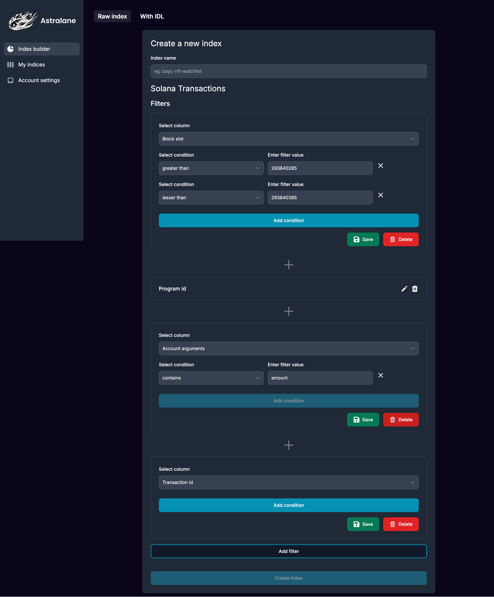
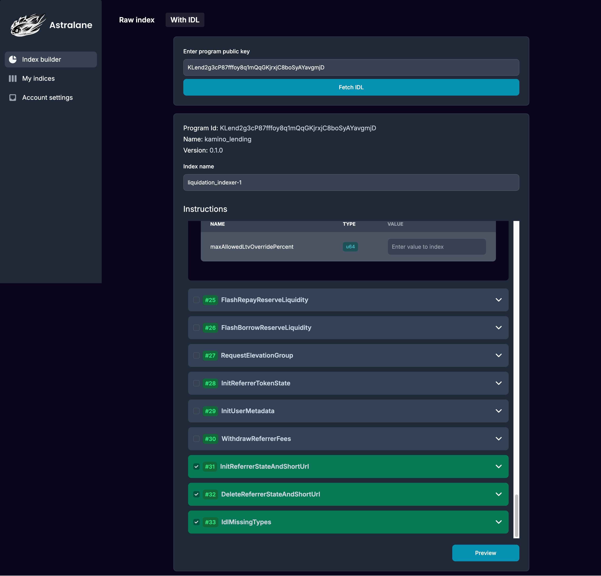
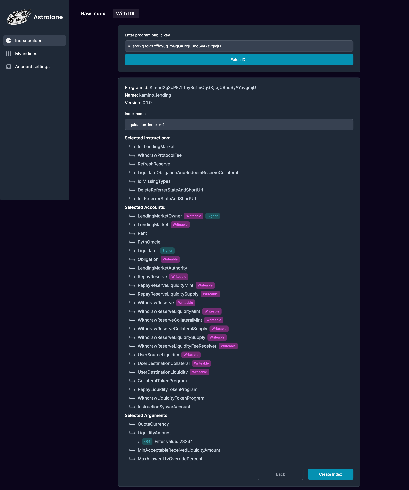
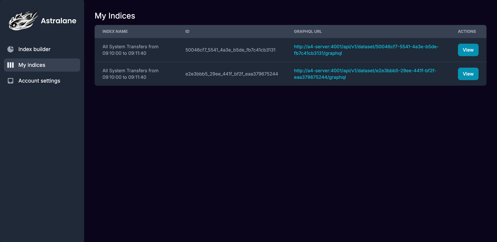
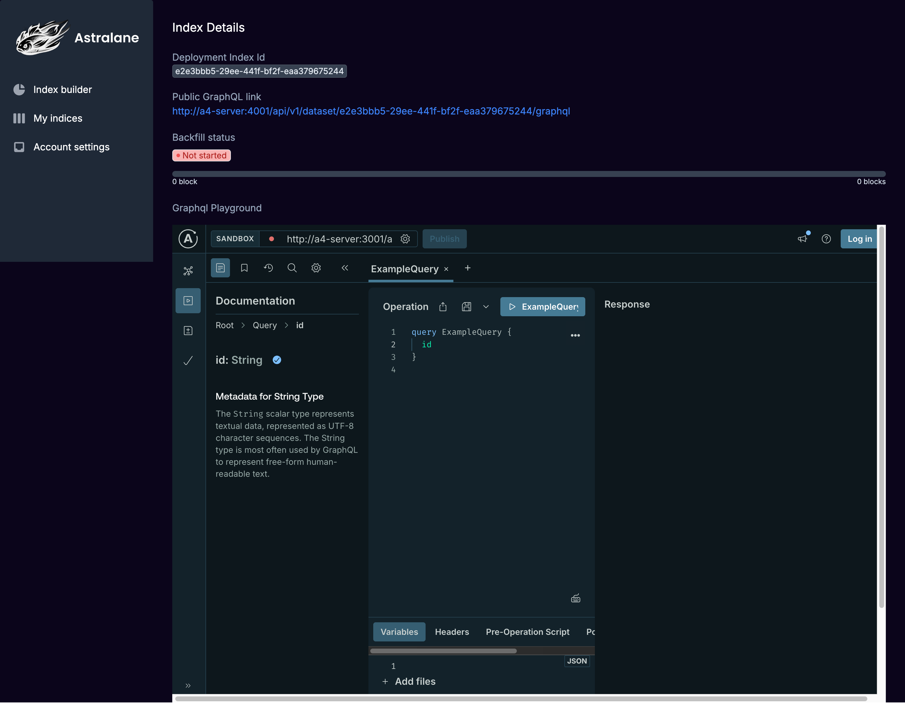
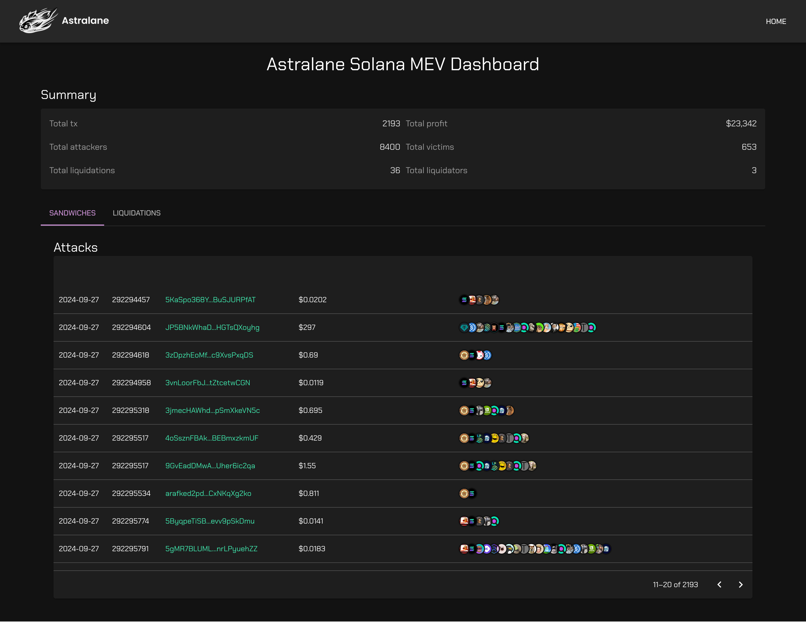
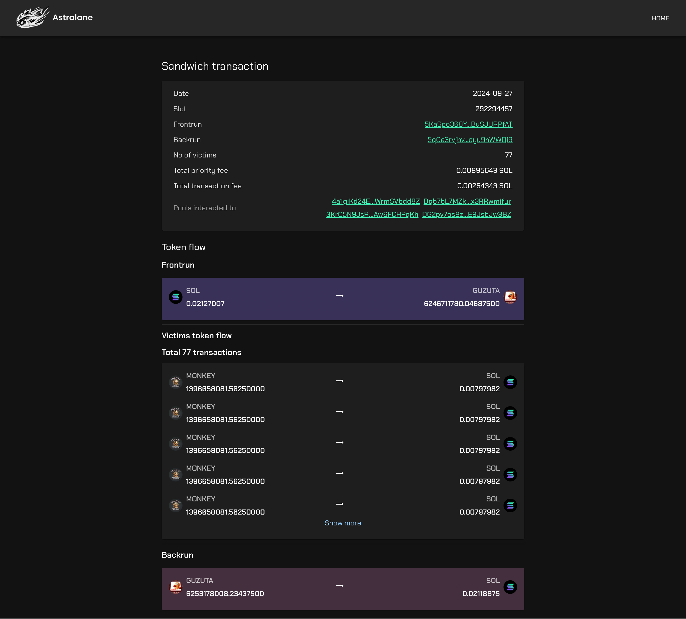
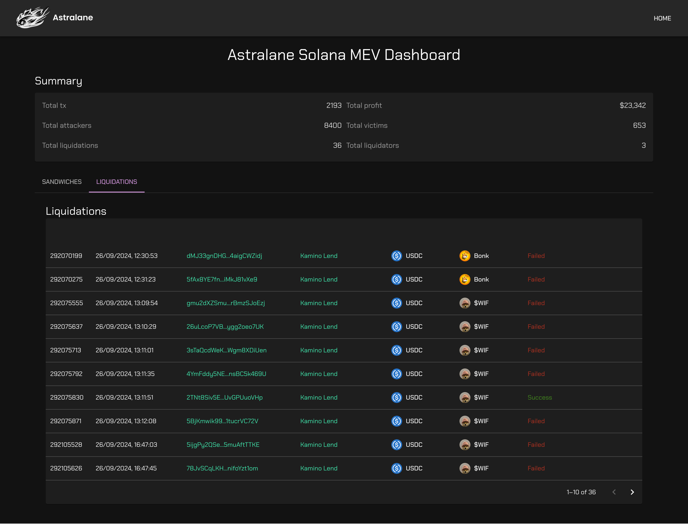
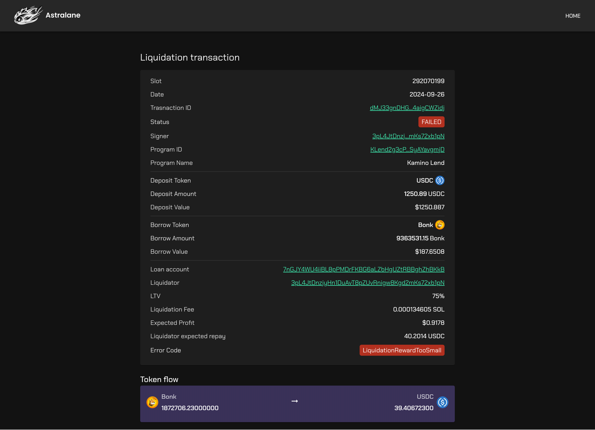
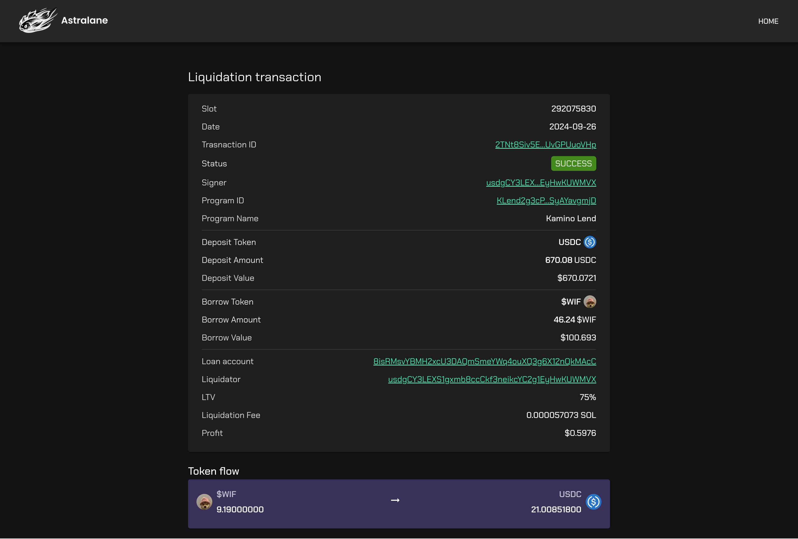

# **Astralane - Institutional-grade infrastructure for Solana** 

## 🚀 Overview

Astralane provides a highly reliable, scalable, and robust infrastructure for Solana projects. Our system is built to cater to institutional needs, offering seamless streaming services and powerful indexing solutions for developers working on Solana blockchain applications.

## 📂 Tech Stack

### 1. **High Speed Indexers**
- **Description**: Astralane’s indexing services offers efficient, real-time blockchain data for advanced app features.

Code Repos:
- [**Astralane geyser plugin**](https://github.com/Astralane/astralane-geyser-plugin): Customized geyser plugin which works with index worker for active filler.
- [**Astralane protos**](https://github.com/Astralane/astralane-protos): Protos used for Geyser plugin 
- [**Astralane car parser**](https://github.com/Astralane/astralane-car-parser): Running and maintaining the car parsing logic which traverses the files and generates clickhouse DBs or updates them.
- [**Astralane Index worker**](https://github.com/Astralane/astralane-index-worker): Core Index worker logic which contains parsers for instructions and arguments.
- [**Astralane Index grapql server**](https://github.com/Astralane/astralane-index-graphql-server): Serving indexed data from the DB via graphql server.
- [**Astralane Index admin server**](https://github.com/Astralane/astralane-admin-server-js): Admin server client for auth and maintaining backfiller jobs etc - Controls Index server workers and maintains them.
- [**Astralane price parser**](https://github.com/Astralane/astralane-price-parser): Price parser which fetches data from Pyth and Birdseye
- [**Astralane solana mev substream**](https://github.com/Astralane/solana-mev-substream): Parsing raw transactions, identifying sandwich attacks and liquidations based filtering brontes methedology and streams it through substreams.
- [**Astralane substream client**](https://github.com/Astralane/substream-client): Consumes data from mev subtreams and sink to the Clickhouse DB.
- [**Astralane mev indxer backend**](https://github.com/Astralane/mev-indexer-be): Rest API's to query collected mev data's from the Clickhouse DB

- [**Indexer Docs**](https://www.notion.so/audacelabs/Astralane-Indexer-Public-Docs-d506444ec9c24c3086e740743cda5df6)

### 2. **Low Latency middleware**
-- **Description**: A Rust-based low latency middleware designed for high performance, global distribution and robustness. Privacy, Security, No Filter, Max Profit Relay for Streaming, Sending and bundling. 
- [**Astralane streaming server**](https://github.com/Astralane/astralane-streaming-server).
- [**Astralane streaming client**](https://github.com/Astralane/substream-client).
- [**Bare Documentation**](https://audacelabs.notion.site/Astralane-Low-Latency-Data-Streams-bcb94914ab45467abe9f5d31405f2379)
- Reach out to hi@astralane.io for access to colo, gRPC, websockets, txn sending endpoints, etc.

## 📱 Core Products Overview (Radar Hack)

### 1. **Program Indexer UI**
 - [**Code Repo**](https://github.com/Astralane/astralane-streaming-fe)
 - [**Live Demo Link**](https://a4.astralane.io/) 
- **Description**: This app provides user interface to fetch IDL and config indxing based on various filters by selecting them.
- **Features**:
  - Create raw transaction indxer with filters
  - Create program indxer with IDL and filters
  - Manage created index
  - Start and stop backfilling jobs
- **Screenshot**:
  
  
  
  
  

### 2. **Mev Dashboard 2**
 - [**Code Repo**](https://github.com/Astralane/mev-indexer-ui)
 - [**Live Demo Link**](https://a4.astralane.io/mev) 
- **Description**: View the mev sandwich attacks and liquidations captured through our Astralane mev subtream.
- **Features**:
  - View sandwich attacks overview, profits and details of attack
  - View liquidations including failed one as well and details of the liquidations
- **Screenshot**:
  
  
  
  
  

### 3. **Account Indexer with DEX Pnl**
- Watch the video on how the pnl indexer data looks like for an account: [**Pnl Indexing**](https://drive.google.com/file/d/1xJ82ZDAxBcRbUWk-oGq0iulj6VHm3BS1/view)

## 📄 Documentation
- [**API documentation**](http://198.244.253.172:3002/api-docs)

## 🔗 Additional Resources
- [Website](https://www.astralane.io/)
- [Twitter](https://x.com/Astralaneio)

